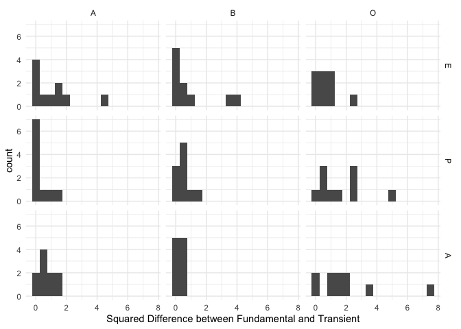

<!-- README.md is generated from README.Rmd. Please edit that file -->

# inteRact

<!-- badges: start -->
<!-- badges: end -->

The goal of inteRact is to make affect control theory (ACT) equations
accessible to a broader audience of social scientists.

ACT is a theory of social behavior that hinges on the control principle
of people acting in ways to confirm cultural meaning. ACT theoretical
concepts have been used fruitfully in recent research within cultural
sociology (Hunzaker 2014, 2018), stratification and occupational
research (Freeland and Hoey 2018), social movements research (shuster
and Campos-Castillo. 2017), gender and victimization (Boyle and McKinzie
2015; Boyle and Walker 2016). Information about ACT as a theory can be
accessed here: <https://research.franklin.uga.edu/act/>

The goal of this package is to make elements of typical ACT analyses
easier to implement into R: calculating the deflection of an event, the
optimal behavior of an actor after an event, the relabeling of the actor
or object after an event, and calculating emotions within events. You
can look within the functions to see how the equations were programmed,
but to truly get a handle on the equations and how they work, I refer
you to Expressive Order (Heise 2010).

## Installation

You can install the development version from
[GitHub](https://github.com/) with:

``` r
# install.packages("devtools")
devtools::install_github("ekmaloney/inteRact")
```

## Example Analysis

The following analysis is an example of how to use this package to
implement ACT equations in your work. Functions can be applied to either
a single event or a dataframe of events, to make analyzing a larger
number of situations easier.

First, for any analysis you do, you need to ensure that the identities,
behaviors, and modifiers that you study are measured in the ACT
dictionary. inteRact includes the US dictionary that was measured in
2015 as the default dictionary (us\_2015\_full) and uses the US
equations as default for calculations.

Future versions will allow you to upload your own dictionaries and use
them in calculations.

The following code samples 20 identities and 10 behaviors to create a 10
event dataframe for the analysis.

``` r
library(inteRact)
#> Loading required package: actdata
library(actdata)
library(tidyverse)
#> ── Attaching packages ─────────────────────────────────────── tidyverse 1.3.1 ──
#> ✓ ggplot2 3.3.5     ✓ purrr   0.3.4
#> ✓ tibble  3.1.6     ✓ dplyr   1.0.7
#> ✓ tidyr   1.1.4     ✓ stringr 1.4.0
#> ✓ readr   2.1.1     ✓ forcats 0.5.1
#> ── Conflicts ────────────────────────────────────────── tidyverse_conflicts() ──
#> x dplyr::filter() masks stats::filter()
#> x dplyr::lag()    masks stats::lag()

#get US 2015 dictionary using the epa subset from the actdata package
us_2015 <- epa_subset(dataset = "usfullsurveyor2015")

#make a dataframe of events 
set.seed(814)
events <- tibble(actor = sample(us_2015$term[us_2015$component == "identity"], 10),
                 behavior = sample(us_2015$term[us_2015$component == "behavior"], 10),
                 object = sample(us_2015$term[us_2015$component == "identity"], 10))

print(events)
#> # A tibble: 10 × 3
#>    actor                behavior        object                 
#>    <chr>                <chr>           <chr>                  
#>  1 celebrity            work            customs_officer        
#>  2 employer             say_farewell_to fiend                  
#>  3 innocent             suck_up_to      traitor                
#>  4 sheriff              debate_with     lackey                 
#>  5 alcoholic            beg             male                   
#>  6 chinese              deprecate       black                  
#>  7 in_law               implicate       welder                 
#>  8 assembly_line_worker suspect         barber                 
#>  9 mobster              shock           manager_of_branch_store
#> 10 immigrant            refuse          bricklayer
```

### Deflection

To calculate deflection for a single event, you can use the function
*calc\_deflection*, which has 4 arguments: actor, behavior, object (all
character strings), and dictionary (set to US currently). To calculate
deflection for a series of events, you can use the function
*batch\_deflection* which has 1 argument: a dataframe with an actor,
behavior, and object column (must be named that). For example, to find
the deflection of you would do the following:

``` r
d <- get_deflection(act = "brute", 
                    beh = "work", 
                    obj = "cook", 
                    dictionary_key = "usfullsurveyor2015",
                    gender = "average",
                    equation_key = "us2010")

print(d)
#> [1] 11.41019
```

To calculate the deflection of all of the events in the sample events
dataframe, you would do the following:

``` r
events <- events %>% 
          rowwise() %>% 
          mutate(d = get_deflection(actor, behavior, object, dictionary_key = "usfullsurveyor2015",
                    gender = "average",
                    equation_key = "us2010"))

print(events)
#> # A tibble: 10 × 4
#> # Rowwise: 
#>    actor                behavior        object                      d
#>    <chr>                <chr>           <chr>                   <dbl>
#>  1 celebrity            work            customs_officer          4.10
#>  2 employer             say_farewell_to fiend                    8.28
#>  3 innocent             suck_up_to      traitor                  9.11
#>  4 sheriff              debate_with     lackey                   2.58
#>  5 alcoholic            beg             male                     5.09
#>  6 chinese              deprecate       black                   18.9 
#>  7 in_law               implicate       welder                   4.80
#>  8 assembly_line_worker suspect         barber                   7.22
#>  9 mobster              shock           manager_of_branch_store 11.1 
#> 10 immigrant            refuse          bricklayer               9.21
```

### Element Deflection

Additionally, you can see which elements contribute the most to the
overall deflection by using the *element\_deflection* function, as
below. This returns a dataframe that includes each element’s fundamental
sentiment, the corresponding transient impression, the difference
between the two, and the squared difference. In this way, you can see
which element moved the most in EPA space after an event. In the case of
brute works cook, the most deflection element-dimension is the Power of
the Object (cook) followed by the Evaluation of the Actor (brute),

``` r
print(element_deflection("brute", "work", "cook", dictionary_key = "usfullsurveyor2015",
                    gender = "average",
                    equation_key = "us2010"))
#> # A tibble: 9 × 7
#>   term  element dimension fundamental_sentiment trans_imp[,1] difference[,1]
#>   <chr> <chr>   <fct>                     <dbl>         <dbl>          <dbl>
#> 1 brute A       E                         -1.97        -1.86          -0.106
#> 2 brute A       P                          1.74         1.45           0.288
#> 3 brute A       A                          1.44         1.31           0.132
#> 4 work  B       E                          0.27        -1.87           2.14 
#> 5 work  B       P                          1.51         1.92          -0.412
#> 6 work  B       A                          0.99         1.44          -0.447
#> 7 cook  O       E                          2.24         1.40           0.837
#> 8 cook  O       P                          1.69        -0.248          1.94 
#> 9 cook  O       A                          1.58         0.203          1.38 
#> # … with 1 more variable: sqd_diff <dbl[,1]>
```

You can do this for an entire dataframe with a little bit of nesting, as
follows:

``` r
elem_def <- events %>%
            rowwise() %>%
            mutate(el_def = list(element_deflection(actor, behavior, object, 
                                                    dictionary_key = "usfullsurveyor2015",
                                                    gender = "average",
                                                    equation_key = "us2010"))) %>%
            unnest(el_def)

head(elem_def)
#> # A tibble: 6 × 11
#>   actor     behavior object        d term    element dimension fundamental_sent…
#>   <chr>     <chr>    <chr>     <dbl> <chr>   <chr>   <fct>                 <dbl>
#> 1 celebrity work     customs_…  4.10 celebr… A       E                      0.25
#> 2 celebrity work     customs_…  4.10 celebr… A       P                      2.25
#> 3 celebrity work     customs_…  4.10 celebr… A       A                      2.16
#> 4 celebrity work     customs_…  4.10 work    B       E                      0.27
#> 5 celebrity work     customs_…  4.10 work    B       P                      1.51
#> 6 celebrity work     customs_…  4.10 work    B       A                      0.99
#> # … with 3 more variables: trans_imp <dbl[,1]>, difference <dbl[,1]>,
#> #   sqd_diff <dbl[,1]>
```

Following this, you can look at how different elements contribute to the
overall deflection across your events:

``` r
ggplot(data = elem_def, mapping = aes(x = sqd_diff)) + 
      geom_histogram(binwidth = 0.5) + facet_grid(dimension ~ element) + 
      theme_minimal() + labs(x = "Squared Difference between Fundamental and Transient")
```



### Optimal Behavior

ACT can also predict the optimal behavior for the actor to enact in the
following interaction that would bring the transient sentiments back as
close as possible to the fundamental sentiments. The function
*optimal\_behavior* finds the E, P, and A value for the optimal behavior

``` r
beh <- optimal_behavior(act = "ceo", beh = "advise",  obj = "benefactor",
                        dictionary_key = "usfullsurveyor2015",
                        gender = "average",
                        equation_key = "us2010", 
                        which = "actor")
beh
#> # A tibble: 1 × 4
#>   opt_E opt_P opt_A term 
#>   <dbl> <dbl> <dbl> <chr>
#> 1 0.505  1.55  1.02 actor
```

### Closest Term

To find the closest measured identity, modifier, or behavior to an EPA
profile, you can use the function *closest\_term* which has 5 arguments:
the E, P, and A measurements, the type of term (identity, modifier, or
behavior, and the maximum distance away in EPA units the term can be).

``` r
closest_term(beh$opt_E, beh$opt_P, beh$opt_A, term_typ = "behavior", dictionary_key = "usfullsurveyor2015",
                                                gender = "average",max_dist = 1)
#> # A tibble: 10 × 5
#>    term_name     term_E term_P term_A    ssd
#>    <chr>          <dbl>  <dbl>  <dbl>  <dbl>
#>  1 outdo           0.61   1.66   1.19 0.0524
#>  2 work            0.27   1.51   0.99 0.0576
#>  3 grasp           0.29   1.38   0.84 0.107 
#>  4 urge            0.65   1.51   1.37 0.143 
#>  5 titillate       0.66   1.27   1.27 0.161 
#>  6 stop            0.24   1.81   1.24 0.188 
#>  7 disagree_with   0.11   1.26   1.09 0.242 
#>  8 exalt           0.72   1.08   1.08 0.266 
#>  9 catch           1.01   1.63   1.12 0.272 
#> 10 confront        0.39   1.99   1.28 0.277

closest_term(beh$opt_E, beh$opt_P, beh$opt_A, term_typ = "behavior", dictionary_key = "usfullsurveyor2015",
                                                gender = "average",max_dist = 0.5)
#> # A tibble: 10 × 5
#>    term_name     term_E term_P term_A    ssd
#>    <chr>          <dbl>  <dbl>  <dbl>  <dbl>
#>  1 outdo           0.61   1.66   1.19 0.0524
#>  2 work            0.27   1.51   0.99 0.0576
#>  3 grasp           0.29   1.38   0.84 0.107 
#>  4 urge            0.65   1.51   1.37 0.143 
#>  5 titillate       0.66   1.27   1.27 0.161 
#>  6 stop            0.24   1.81   1.24 0.188 
#>  7 disagree_with   0.11   1.26   1.09 0.242 
#>  8 exalt           0.72   1.08   1.08 0.266 
#>  9 catch           1.01   1.63   1.12 0.272 
#> 10 confront        0.39   1.99   1.28 0.277
```

### Reidentification

Following an ABO event, Actors and Objects can be reidentified by the
other or an onlooker, to an identity that “fits” with their behavior
better. The functions *reidentify\_actor* and *reidentify\_object*
calculate this for you:

``` r
new_id <- events %>% 
          rowwise %>%  
          mutate(new_actor = list(reidentify_actor(actor, behavior, object, 
                                                   dictionary_key = "usfullsurveyor2015",
                        gender = "average",
                        equation_key = "us2010", ))) %>% 
          unnest(new_actor, names_sep = "_")

head(new_id)
#> # A tibble: 6 × 7
#>   actor     behavior        object         d new_actor_E new_actor_P new_actor_A
#>   <chr>     <chr>           <chr>      <dbl>       <dbl>       <dbl>       <dbl>
#> 1 celebrity work            customs_o…  4.10       0.729       1.35        1.11 
#> 2 employer  say_farewell_to fiend       8.28      -0.971       0.661      -1.21 
#> 3 innocent  suck_up_to      traitor     9.11      -1.16       -1.45        0.566
#> 4 sheriff   debate_with     lackey      2.58      -0.226       1.69        1.87 
#> 5 alcoholic beg             male        5.09       0.113      -2.32        0.484
#> 6 chinese   deprecate       black      18.9       -2.53        0.261       1.18
```
