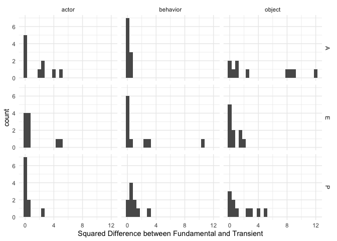

<!-- README.md is generated from README.Rmd. Please edit that file -->

# inteRact

<!-- badges: start -->

<!-- badges: end -->

The goal of inteRact is to make affect control theory (ACT) equations
accessible to a broader audience of social scientists. Information about
ACT as a theory can be accessed here:
<https://research.franklin.uga.edu/act/>

## Installation

You can install the development version from
[GitHub](https://github.com/) with:

``` r
# install.packages("devtools")
devtools::install_github("ekmaloney/inteRact")
```

## Example Analysis

The following analysis is an example of how to use this package to
implement ACT equations in your work. There are two versions of every
function: single and batch. The single version takes in a single event
and the batch takes in a dataframe of many events to make it easier to
calculate the concept of interest for many events at once.

First, for any analysis you do, you need to ensure that the identities,
behaviors, and modifiers that you study are measured in the ACT
dictionary. inteRact includes the US dictionary that was measured in
2015 as the default dictionary (us\_2015\_full) and uses the US
equations as default for calculations.

Future versions will allow you to upload your own dictionaries and use
them in calculations.

First, the following code samples 20 identities and 10 behaviors to
create a 10 event dataframe for the analysis.

``` r
library(inteRact)
library(kableExtra)
library(knitr)
library(tibble)
library(tidyverse)
#> ── Attaching packages ─────────────────────────────────────── tidyverse 1.3.0 ──
#> ✓ ggplot2 3.3.2     ✓ dplyr   1.0.2
#> ✓ tidyr   1.1.2     ✓ stringr 1.4.0
#> ✓ readr   1.4.0     ✓ forcats 0.5.0
#> ✓ purrr   0.3.4
#> ── Conflicts ────────────────────────────────────────── tidyverse_conflicts() ──
#> x dplyr::filter()     masks stats::filter()
#> x dplyr::group_rows() masks kableExtra::group_rows()
#> x dplyr::lag()        masks stats::lag()

#load US dictionary 
data("us_2015_full")

#make a dataframe of events 
set.seed(814)
events <- tibble(actor = sample(us_2015_full$term[us_2015_full$type == "identity"], 10),
                 behavior = sample(us_2015_full$term[us_2015_full$type == "behavior"], 10),
                 object = sample(us_2015_full$term[us_2015_full$type == "identity"], 10))

kable(events, caption = "Sample Events for Analysis")
```

<table>

<caption>

Sample Events for Analysis

</caption>

<thead>

<tr>

<th style="text-align:left;">

actor

</th>

<th style="text-align:left;">

behavior

</th>

<th style="text-align:left;">

object

</th>

</tr>

</thead>

<tbody>

<tr>

<td style="text-align:left;">

brute

</td>

<td style="text-align:left;">

work

</td>

<td style="text-align:left;">

cook

</td>

</tr>

<tr>

<td style="text-align:left;">

dolt

</td>

<td style="text-align:left;">

say\_farewell\_to

</td>

<td style="text-align:left;">

executioner

</td>

</tr>

<tr>

<td style="text-align:left;">

husband

</td>

<td style="text-align:left;">

suck\_up\_to

</td>

<td style="text-align:left;">

trainee

</td>

</tr>

<tr>

<td style="text-align:left;">

sheet\_metal\_worker

</td>

<td style="text-align:left;">

debate\_with

</td>

<td style="text-align:left;">

junkie

</td>

</tr>

<tr>

<td style="text-align:left;">

hindu

</td>

<td style="text-align:left;">

beg

</td>

<td style="text-align:left;">

lout

</td>

</tr>

<tr>

<td style="text-align:left;">

casual\_laborer

</td>

<td style="text-align:left;">

deprecate

</td>

<td style="text-align:left;">

bailiff

</td>

</tr>

<tr>

<td style="text-align:left;">

housebreaker

</td>

<td style="text-align:left;">

implicate

</td>

<td style="text-align:left;">

welder

</td>

</tr>

<tr>

<td style="text-align:left;">

addict

</td>

<td style="text-align:left;">

suspect

</td>

<td style="text-align:left;">

assistant

</td>

</tr>

<tr>

<td style="text-align:left;">

millionaire

</td>

<td style="text-align:left;">

shock

</td>

<td style="text-align:left;">

machine\_repairer

</td>

</tr>

<tr>

<td style="text-align:left;">

hothead

</td>

<td style="text-align:left;">

refuse

</td>

<td style="text-align:left;">

blind\_person

</td>

</tr>

</tbody>

</table>

### Deflection

To calculate deflection for a single event, you can use the function
*calc\_deflection*, which has 4 arguments: actor, behavior, object (all
character strings), and dictionary (set to US currently). To calculate
deflection for a series of events, you can use the function
*batch\_deflection* which has 1 argument: a dataframe with an actor,
behavior, and object column (must be named that). For example, to find
the deflection of you would do the following:

``` r
calc_deflection("brute", "work", "cook")
#> # A tibble: 1 x 1
#>       d
#>   <dbl>
#> 1  3.91
```

To calculate the deflection of all of the events in the sample events
dataframe, you would do the following:

``` r
batch_deflection(events)
#> # A tibble: 10 x 4
#> # Rowwise: 
#>    actor              behavior        object           deflection$d
#>    <chr>              <chr>           <chr>                   <dbl>
#>  1 brute              work            cook                     3.91
#>  2 dolt               say_farewell_to executioner              3.51
#>  3 husband            suck_up_to      trainee                 10.5 
#>  4 sheet_metal_worker debate_with     junkie                   3.43
#>  5 hindu              beg             lout                     5.02
#>  6 casual_laborer     deprecate       bailiff                  7.20
#>  7 housebreaker       implicate       welder                   2.25
#>  8 addict             suspect         assistant                3.94
#>  9 millionaire        shock           machine_repairer         4.07
#> 10 hothead            refuse          blind_person             2.71
```

This is mainly a convenience function - if you are interested in seeing
the code behind it, this is how you could do it outside of the batch
function:

``` r
events %>%
  rowwise() %>%
  mutate(deflection = calc_deflection(actor, behavior, object),
         deflection = deflection$d)
#> # A tibble: 10 x 4
#> # Rowwise: 
#>    actor              behavior        object           deflection
#>    <chr>              <chr>           <chr>                 <dbl>
#>  1 brute              work            cook                   3.91
#>  2 dolt               say_farewell_to executioner            3.51
#>  3 husband            suck_up_to      trainee               10.5 
#>  4 sheet_metal_worker debate_with     junkie                 3.43
#>  5 hindu              beg             lout                   5.02
#>  6 casual_laborer     deprecate       bailiff                7.20
#>  7 housebreaker       implicate       welder                 2.25
#>  8 addict             suspect         assistant              3.94
#>  9 millionaire        shock           machine_repairer       4.07
#> 10 hothead            refuse          blind_person           2.71
```

### Element Deflection

Additionally, you can see which elements contribute the most to the
overall deflection by using the *element\_deflection* function, as
below. This returns a dataframe that includes each element’s fundamental
sentiment, the corresponding transient impression, the difference
between the two, and the squared difference. In this way, you can see
which element moved the most in EPA space after an event. In the case of
brute works cook, the most deflection element-dimension is the Power of
the Object (cook) followed by the Evaluation of the Actor (brute),

``` r
kable(element_deflection("brute", "work", "cook"), digits = 3)
```

<table>

<thead>

<tr>

<th style="text-align:left;">

term

</th>

<th style="text-align:left;">

element

</th>

<th style="text-align:left;">

dimension

</th>

<th style="text-align:right;">

fundamental\_sentiment

</th>

<th style="text-align:right;">

trans\_imp

</th>

<th style="text-align:right;">

difference

</th>

<th style="text-align:right;">

sqd\_diff

</th>

</tr>

</thead>

<tbody>

<tr>

<td style="text-align:left;">

brute

</td>

<td style="text-align:left;">

A

</td>

<td style="text-align:left;">

E

</td>

<td style="text-align:right;">

\-1.97

</td>

<td style="text-align:right;">

\-1.178

</td>

<td style="text-align:right;">

\-0.792

</td>

<td style="text-align:right;">

0.626

</td>

</tr>

<tr>

<td style="text-align:left;">

brute

</td>

<td style="text-align:left;">

A

</td>

<td style="text-align:left;">

P

</td>

<td style="text-align:right;">

1.74

</td>

<td style="text-align:right;">

1.571

</td>

<td style="text-align:right;">

0.169

</td>

<td style="text-align:right;">

0.029

</td>

</tr>

<tr>

<td style="text-align:left;">

brute

</td>

<td style="text-align:left;">

A

</td>

<td style="text-align:left;">

A

</td>

<td style="text-align:right;">

1.44

</td>

<td style="text-align:right;">

1.148

</td>

<td style="text-align:right;">

0.292

</td>

<td style="text-align:right;">

0.085

</td>

</tr>

<tr>

<td style="text-align:left;">

work

</td>

<td style="text-align:left;">

B

</td>

<td style="text-align:left;">

E

</td>

<td style="text-align:right;">

0.27

</td>

<td style="text-align:right;">

\-0.346

</td>

<td style="text-align:right;">

0.616

</td>

<td style="text-align:right;">

0.379

</td>

</tr>

<tr>

<td style="text-align:left;">

work

</td>

<td style="text-align:left;">

B

</td>

<td style="text-align:left;">

P

</td>

<td style="text-align:right;">

1.51

</td>

<td style="text-align:right;">

1.457

</td>

<td style="text-align:right;">

0.053

</td>

<td style="text-align:right;">

0.003

</td>

</tr>

<tr>

<td style="text-align:left;">

work

</td>

<td style="text-align:left;">

B

</td>

<td style="text-align:left;">

A

</td>

<td style="text-align:right;">

0.99

</td>

<td style="text-align:right;">

0.999

</td>

<td style="text-align:right;">

\-0.009

</td>

<td style="text-align:right;">

0.000

</td>

</tr>

<tr>

<td style="text-align:left;">

cook

</td>

<td style="text-align:left;">

O

</td>

<td style="text-align:left;">

E

</td>

<td style="text-align:right;">

2.24

</td>

<td style="text-align:right;">

1.240

</td>

<td style="text-align:right;">

1.000

</td>

<td style="text-align:right;">

0.999

</td>

</tr>

<tr>

<td style="text-align:left;">

cook

</td>

<td style="text-align:left;">

O

</td>

<td style="text-align:left;">

P

</td>

<td style="text-align:right;">

1.69

</td>

<td style="text-align:right;">

0.464

</td>

<td style="text-align:right;">

1.226

</td>

<td style="text-align:right;">

1.504

</td>

</tr>

<tr>

<td style="text-align:left;">

cook

</td>

<td style="text-align:left;">

O

</td>

<td style="text-align:left;">

A

</td>

<td style="text-align:right;">

1.58

</td>

<td style="text-align:right;">

1.051

</td>

<td style="text-align:right;">

0.529

</td>

<td style="text-align:right;">

0.280

</td>

</tr>

</tbody>

</table>

Again, you can do this for an entire dataframe using
*batch\_element\_deflection*:

``` r
elem_def <- batch_element_deflection(events)
elem_def 
#> # A tibble: 90 x 10
#>    actor behavior object term  element dimension fundamental_sen… trans_imp
#>    <chr> <chr>    <chr>  <chr> <chr>   <chr>                <dbl>     <dbl>
#>  1 brute work     cook   brute A       E                    -1.97    -1.18 
#>  2 brute work     cook   brute A       P                     1.74     1.57 
#>  3 brute work     cook   brute A       A                     1.44     1.15 
#>  4 brute work     cook   work  B       E                     0.27    -0.346
#>  5 brute work     cook   work  B       P                     1.51     1.46 
#>  6 brute work     cook   work  B       A                     0.99     0.999
#>  7 brute work     cook   cook  O       E                     2.24     1.24 
#>  8 brute work     cook   cook  O       P                     1.69     0.464
#>  9 brute work     cook   cook  O       A                     1.58     1.05 
#> 10 dolt  say_far… execu… dolt  A       E                    -0.97    -0.519
#> # … with 80 more rows, and 2 more variables: difference <dbl>, sqd_diff <dbl>
```

Following this, you can look at how different elements contribute to the
overall deflection across your events:

``` r
ggplot(data = elem_def, mapping = aes(x = sqd_diff)) + 
      geom_histogram(binwidth = 0.5) + facet_grid(dimension ~ element) + 
      theme_minimal() + labs(x = "Squared Difference between Fundamental and Transient")
```



### Optimal Behavior

``` r
beh <- optimal_behavior("brute", "work", "cook")
beh
#> # A tibble: 1 x 3
#>        E     P     A
#>    <dbl> <dbl> <dbl>
#> 1 -0.110 0.763  1.61
```

### Closest Term

``` r
closest_term(beh$E, beh$P, beh$A, term_typ = "behavior", max_dist = 1)
#> # A tibble: 45 x 17
#>    term      E     P     A    E2    P2    A2 type  country  year      d_e
#>    <chr> <dbl> <dbl> <dbl> <dbl> <dbl> <dbl> <chr> <chr>   <dbl>    <dbl>
#>  1 hagg… -0.26  0.84  1.59 -0.26  0.84  1.59 beha… US       2015 -0.150  
#>  2 paro… -0.01  0.8   1.46 -0.01  0.8   1.46 beha… US       2015  0.0998 
#>  3 prea…  0.33  1.09  1.58  0.33  1.09  1.58 beha… US       2015  0.440  
#>  4 hurry -0.46  0.75  2.04 -0.46  0.75  2.04 beha… US       2015 -0.350  
#>  5 disp… -0.1   1.32  1.54 -0.1   1.32  1.54 beha… US       2015  0.00978
#>  6 dare  -0.53  0.86  1.24 -0.53  0.86  1.24 beha… US       2015 -0.420  
#>  7 laug… -0.56  0.85  1.99 -0.56  0.85  1.99 beha… US       2015 -0.450  
#>  8 jest  -0.44  0.28  1.48 -0.44  0.28  1.48 beha… US       2015 -0.330  
#>  9 ravi…  0.24  1.24  1.42  0.24  1.24  1.42 beha… US       2015  0.350  
#> 10 kid    0.22  0.36  1.25  0.22  0.36  1.25 beha… US       2015  0.330  
#> # … with 35 more rows, and 6 more variables: d_p <dbl>, d_a <dbl>, d_e_s <dbl>,
#> #   d_p_s <dbl>, d_a_s <dbl>, ssd <dbl>

closest_term(beh$E, beh$P, beh$A, term_typ = "behavior", max_dist = 0.5)
#> # A tibble: 11 x 17
#>    term      E     P     A    E2    P2    A2 type  country  year      d_e
#>    <chr> <dbl> <dbl> <dbl> <dbl> <dbl> <dbl> <chr> <chr>   <dbl>    <dbl>
#>  1 hagg… -0.26  0.84  1.59 -0.26  0.84  1.59 beha… US       2015 -0.150  
#>  2 paro… -0.01  0.8   1.46 -0.01  0.8   1.46 beha… US       2015  0.0998 
#>  3 prea…  0.33  1.09  1.58  0.33  1.09  1.58 beha… US       2015  0.440  
#>  4 hurry -0.46  0.75  2.04 -0.46  0.75  2.04 beha… US       2015 -0.350  
#>  5 disp… -0.1   1.32  1.54 -0.1   1.32  1.54 beha… US       2015  0.00978
#>  6 dare  -0.53  0.86  1.24 -0.53  0.86  1.24 beha… US       2015 -0.420  
#>  7 laug… -0.56  0.85  1.99 -0.56  0.85  1.99 beha… US       2015 -0.450  
#>  8 jest  -0.44  0.28  1.48 -0.44  0.28  1.48 beha… US       2015 -0.330  
#>  9 ravi…  0.24  1.24  1.42  0.24  1.24  1.42 beha… US       2015  0.350  
#> 10 kid    0.22  0.36  1.25  0.22  0.36  1.25 beha… US       2015  0.330  
#> 11 josh   0.15  0.39  1.12  0.15  0.39  1.12 beha… US       2015  0.260  
#> # … with 6 more variables: d_p <dbl>, d_a <dbl>, d_e_s <dbl>, d_p_s <dbl>,
#> #   d_a_s <dbl>, ssd <dbl>
```

### Characteristic Emotion

``` r
ce <- characteristic_emotion("brute")
ce
#> # A tibble: 1 x 3
#>       E     P     A
#>   <dbl> <dbl> <dbl>
#> 1 -1.40  3.05  1.46

closest_term(ce[1], ce[2], ce[3], term_typ = "modifier", max_dist = 1)
#> # A tibble: 1 x 17
#>   term      E     P     A    E2    P2    A2 type  country  year  d_e$E  d_p$P
#>   <chr> <dbl> <dbl> <dbl> <dbl> <dbl> <dbl> <chr> <chr>   <dbl>  <dbl>  <dbl>
#> 1 domi… -1.36  2.29  1.45 -1.36  2.29  1.45 modi… US       2015 0.0361 -0.757
#> # … with 5 more variables: d_a$A <dbl>, d_e_s$E <dbl>, d_p_s$P <dbl>,
#> #   d_a_s$A <dbl>, ssd <dbl>
```

``` r
char_e <- batch_characteristic_emotion(events$actor)

char_e %>% 
        dplyr::rowwise() %>% 
        mutate(emotion = list(closest_term(E, P, A, term_typ = "modifier"))) %>% 
        ungroup() %>% 
        unnest(emotion, names_repair = "universal")
```
